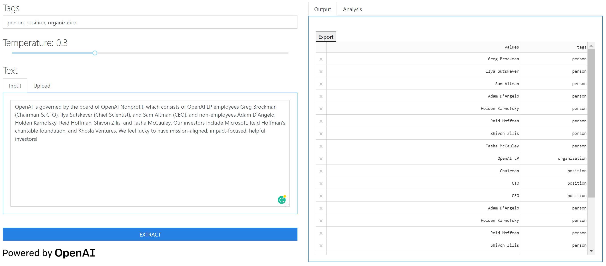
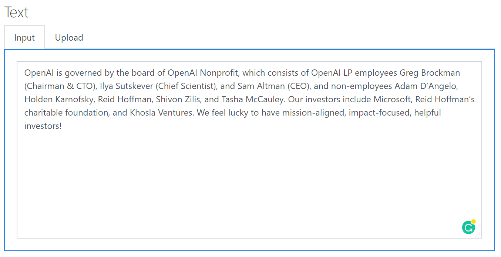

# Multilingual Named Entity Recognition :bookmark_tabs::globe_with_meridians:
https://ner-gpt3.azurewebsites.net/  
Extract entities from multilingual text using named entity recognition (NER) powered by OpenAI's GPT-3. NER labels
sequences of words in a text which are the names of things, such as person and company names. Due to the black-box
nature of GPT-3, larger inputs or datasets are more likely to run into errors and tagging may end prematurely.

## Features :crystal_ball:

### Tagging :label:
The tags for entities can be manually defined. Just input the tags you would like the app to search for into the input
bar. The resulting output only contains the tags defined. For automatic tag generation, just leave this input blank.

### Temperature :fire:
Temperature controls randomness. Lowering results in less random completions. As temperature approaches zero, the model
will become deterministic and repetitive. Given the task, we do not want a very "creative" model, as this creates issues
in the output. A temperature of around 0.5 works decently well. Feel free to experiment!

Input :keyboard: | Upload :arrow_up:
:----------------:|:--------------:
A textbox is provided for quick text input, copy-and-pasting, and experimentation. | Datasets can be uploaded for entity tagging. Simply select your CSV or Excel formatted dataset and use the dropdown to select the column in the dataset for tagging.
  | 

Output :printer: | Analysis :bar_chart:
:-------------------------:|:-------------------------:
The output contains values (entities) found by GPT-3 and their respective tags. This table can be exported with the click of a button. | The analysis tab contains a histogram breakdown of the count of each tag found.
 | 
